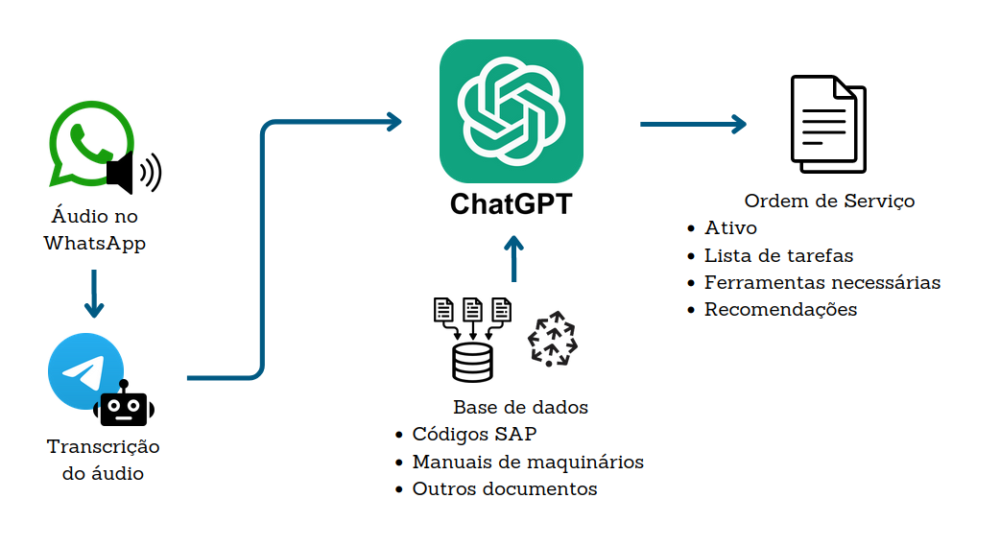

# TracFix
TracFix é uma ferramenta que permite gerar ordens de serviço a partir de áudio. O objetivo é facilitar a rotina de manutenção industrial, com foco no aumento da eficiência do técnico de manutenção. A seguir, explicamos a implementação utilizando a imagem abaixo. 

- **Encaminhamento de áudio para o Bot**: O usuário encaminha o áudio recebido no WhatsApp para o bot da TracFix no Telegram, um processo simples e intuitivo.
- **Transcrição e Geração de Ordens de Serviço**: O bot transcreve o áudio recebido e utiliza a API do ChatGPT para gerar ordens de serviço a partir da transcrição.
- **Banco de Dados**: O sistema conta com uma base de dados que armazena manuais de máquinas, planilhas de ferramentas e outros documentos em formato de embeddings, utilizando PineCone.

